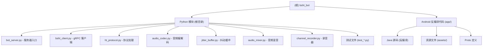

# BSHT Bot - AI 项目上下文

> 最后更新: 2026-02-17 00:11:21

## 变更记录 (Changelog)

| 日期 | 变更内容 |
|------|----------|
| 2026-02-17 | 初始化项目 AI 上下文文档 |

---

## 项目愿景

BSHT Bot 是一个基于 Python 的微信助手应用，实现了与 BSHT (Ham Radio/即时通讯) 平台的双向通信。主要功能包括：

- **gRPC 客户端**: 完整实现 BSHT 服务的 gRPC 协议通信
- **实时音频流**: 支持 Opus 编解码的实时语音收发
- **频道管理**: 支持频道加入、退出、成员管理、状态监控
- **PTT 通信**: 按键说话 (Push-To-Talk) 功能
- **录音功能**: 频道对话录制，按日期和用户分类存储

---

## 架构总览

### 技术栈

| 层级 | 技术 |
|------|------|
| 通信协议 | gRPC (HTTP/2) + UDP (RTP) |
| 音频编解码 | Opus (48kHz, 960 samples/frame) |
| 数据格式 | Protocol Buffers, MessagePack |
| 语言 | Python 3.8+ |
| 音频库 | PyAudio, numpy |
| 网络库 | httpx[http2] |

### 系统架构

```
                    ┌─────────────────────────────────────────┐
                    │           BSHT Bot Server               │
                    │         (bot_server.py)                 │
                    └─────────────────────────────────────────┘
                                      │
                    ┌─────────────────┼─────────────────┐
                    │                 │                 │
            ┌───────▼──────┐  ┌──────▼──────┐  ┌──────▼──────┐
            │ BSHT Client  │  │ Audio Stream│  │  Protocol   │
            │  (gRPC API)  │  │  Listener   │  │   Handler   │
            └──────────────┘  └─────────────┘  └─────────────┘
                    │                 │                 │
            ┌───────▼──────┐  ┌──────▼──────┐  ┌──────▼──────┐
            │ Token Manager│  │ Audio Mixer │  │ RTP/Heartbeat│
            └──────────────┘  └─────────────┘  └─────────────┘
                                     │
                         ┌───────────┼───────────┐
                         │           │           │
                    ┌────▼───┐  ┌───▼───┐  ┌───▼────┐
                    │ Jitter │  │ Opus  │  │Channel │
                    │ Buffer │  │Codec  │  │Recorder│
                    └────────┘  └───────┘  └────────┘
```

---

## 模块结构图



---

## 模块索引

| 模块 | 路径 | 职责 | 语言 | 状态 |
|------|------|------|------|------|
| Bot Server | `bot_server.py` | 服务器入口，主循环控制 | Python | ✅ 完整 |
| BSHT Client | `bsht_client.py` | gRPC 客户端，API 封装 | Python | ✅ 完整 |
| Protocol Handler | `ht_protocol.py` | RTP/Heartbeat/二进制协议 | Python | ✅ 完整 |
| Audio Codec | `audio_codec.py` | Opus 编解码，音频采集播放 | Python | ✅ 完整 |
| Jitter Buffer | `jitter_buffer.py` | RTP 包重排序，丢包处理 | Python | ✅ 完整 |
| Audio Mixer | `audio_mixer.py` | 多用户音频混音 | Python | ✅ 完整 |
| Channel Recorder | `channel_recorder.py` | 频道对话录制 | Python | ✅ 完整 |
| Android Sources | `app/src/main/java/` | 原始应用反编译代码 | Java | 📁 参考 |

---

## 运行与开发

### 环境要求

```bash
# Python 依赖
pip install -r requirements.txt

# 系统依赖 (Linux)
sudo apt-get install portaudio19-dev libopus0
```

### 快速启动

```bash
# 配置账号信息
# 修改 bot_server.py 中的:
#   USERNAME, PASSWORD, CHANNEL_ID

# 运行
python bot_server.py
```

### PTT 操作

- **空格键**: 按住说话
- **Q 键**: 退出程序

---

## 测试策略

### 测试文件

| 文件 | 用途 |
|------|------|
| `test_protocol.py` | 协议解析测试 |
| `test_audio.py` | 音频编解码测试 |
| `test_bidirectional_audio.py` | 双向音频测试 |
| `test_ptt_with_client.py` | PTT 功能测试 |
| `test_full_duplex.py` | 全双工通信测试 |
| `test_recorder_simple.py` | 录音器测试 |

### 运行测试

```bash
# 单独测试
python test_protocol.py
python test_audio.py

# 完整测试
python test_full_duplex.py
```

---

## 编码规范

- **Python**: PEP 8 风格
- **文档字符串**: Google 风格
- **类型注解**: 使用 typing 模块
- **日志**: 使用 logging 模块，级别 INFO

---

## AI 使用指引

### 关键文件说明

1. **`bsht_client.py`** (2215 行)
   - 完整的 gRPC 客户端实现
   - Token 自动刷新机制
   - 用户认证、频道管理 API
   - 音频流监听器 (UDP/RTP)

2. **`audio_codec.py`** (736 行)
   - Opus 编解码器封装
   - 音频采集器 (AudioRecorder)
   - 音频播放器 (AudioPlayer)
   - PTT 控制器

3. **`ht_protocol.py`** (184 行)
   - RTP 包解析/构建
   - Heartbeat (MessagePack)
   - Binary Packet 协议

4. **`jitter_buffer.py`** (195 行)
   - RTP 包重排序
   - 丢包检测与 PLC
   - 序列号回绕处理

5. **`audio_mixer.py`** (254 行)
   - 多用户音频混音
   - 每用户独立 JitterBuffer
   - 会话统计与回调

### 重要常量

```python
SAMPLE_RATE = 48000      # Opus Fullband
FRAME_SIZE = 960         # 20ms @ 48kHz
CHANNELS = 1             # 单声道
PTT_HOLD_TIMEOUT = 0.30  # 300ms 无按键 = 松开
```

### gRPC 服务端点

```
BASE_URL = "https://rpc.benshikj.com:800"

服务/方法:
- benshikj.User/Login
- benshikj.User/LoadProfile
- benshikj.User/FreshAccessToken
- benshikj.IHT/GetChannels
- benshikj.IHT/GetUserChannels
- benshikj.IHT/JoinChannel
- benshikj.IHT/GetChannelConnectionParm
- benshikj.IHT/GetChannelStatus
- benshikj.IHT/GetChannelMembers
```

---

## 相关文档

- [部署指南](DEPLOY.md)
- [音频模块说明](AUDIO_MODULE_README.md)
- [PTT 集成说明](PTT_INTEGRATION_README.md)
- [全双工通信说明](FULL_DUPLEX_README.md)
- [反编译代码分析](反编译代码分析报告.md)
- [独立服务器方案](独立服务器实现方案分析.md)

---

## 忽略规则

来自 `.gitignore`:
```
__pycache__/
*.pyc
*.pyo
*.pyd
.Python
env/
venv/
.venv/
recordings/
audio_*.raw
*.log
.vscode/
.idea/
.git/
credentials.json
```

合并默认忽略规则后，还忽略:
```
node_modules/**, dist/**, build/**, .next/**, *.lock,
*.bin, *.pdf, *.png, *.jpg, *.jpeg, *.gif, *.mp4, *.zip, *.tar, *.gz
```
