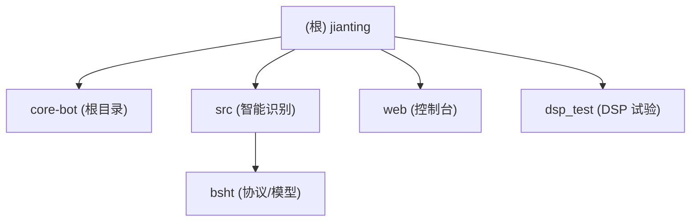

# BSHT Bot - AI 项目上下文

## 变更记录 (Changelog)

| 日期 | 变更内容 |
|------|----------|
| 2026-03-04 | 更新模块结构图、模块索引与模块级文档索引 |
| 2026-02-17 | 初始化项目 AI 上下文文档 |

---

## 项目愿景

BSHT Bot 是一个基于 Python 的微信助手应用，实现与 BSHT (Ham Radio/即时通讯) 平台的双向通信。核心目标是提供稳定的语音收发、频道管理、录音管理与智能识别，并支持 Web 控制台运维。

核心能力包括：

- gRPC 客户端与 BSHT 服务通信
- 实时音频流与 Opus 编解码
- 频道管理、PTT、录音
- 录音智能识别与 DSP 处理（SiliconFlow）
- 识别结果微信推送
- Web 管控与 WebSocket 状态推送

---

## 架构总览

### 技术栈

| 层级 | 技术 |
|------|------|
| 通信协议 | gRPC (HTTP/2) + UDP (RTP) |
| 音频编解码 | Opus (48kHz, 960 samples/frame) |
| 数据格式 | Protocol Buffers, MessagePack |
| 语言 | Python 3.8+ |
| 音频库 | PyAudio, numpy |
| 网络库 | httpx[http2], websocket-client |
| Web | Flask, Flask-SocketIO |
| AI 识别 | SiliconFlow API |
| 推送 | go-wxpush |
| 数据库 | SQLite |

---

## 模块结构图



## 模块索引

| 模块 | 路径 | 职责 | 语言 | 状态 |
|------|------|------|------|------|
| Core Bot | `.` | 传统 Bot、Web 服务入口、音频与协议核心 | Python | 维护中 |
| 智能识别 | `src/` | 智能识别入口、DSP、推送与数据库 | Python | 维护中 |
| BSHT 协议 | `src/bsht/` | 协议/模型/工具实现 | Python | 维护中 |
| Web 控制台 | `web/` | Web 管控、权限与 WebSocket | Python | 维护中 |
| DSP 试验 | `dsp_test/` | DSP 算法与样例测试 | Python | 试验 |

---

## 运行与开发

### 环境要求

```bash
pip install -r requirements.txt
```

如需音频相关依赖，可参考 `requirements_audio.txt`。

### 快速启动

```bash
# Web 控制台 + Bot
python app.py

# 智能识别入口
python src/main.py

# 传统交互式 Bot
python bot_server.py
```

### 配置要点

- Web 控制台配置见 `config.py`
- 智能识别配置见 `src/config.py`（读取 `.env`）

---

## 测试策略

| 路径 | 说明 |
|------|------|
| `tests/test_fixes.py` | 回归修复测试 |
| `dsp_test/test_dsp.py` | DSP 算法测试 |

---

## 编码规范

- Python: PEP 8 风格
- 文档字符串: Google 风格
- 类型注解: typing 模块
- 日志: logging 模块，统一由 `src/logging_setup.py` 管理

---

## AI 使用指引

- 智能识别入口: `src/main.py`
- 识别与 DSP 管线: `src/recognizer.py`, `src/smart_processor.py`
- 推送配置与逻辑: `src/wx_pusher.py`
- 识别提示词: `src/prompts.md`, `src/prompts.json`
- 数据库存储: `src/database.py`, `database.py`, `web/models/database.py`

---

## 变更记录 (Changelog)

| 日期 | 变更内容 |
|------|----------|
| 2026-03-04 | 更新模块结构图、模块索引与模块级文档索引 |
| 2026-02-17 | 初始化项目 AI 上下文文档 |
